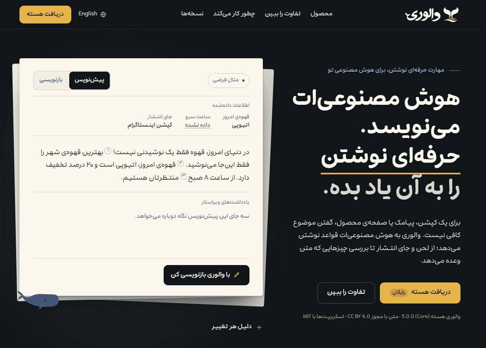
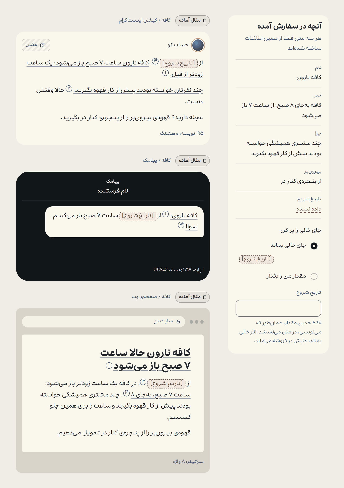
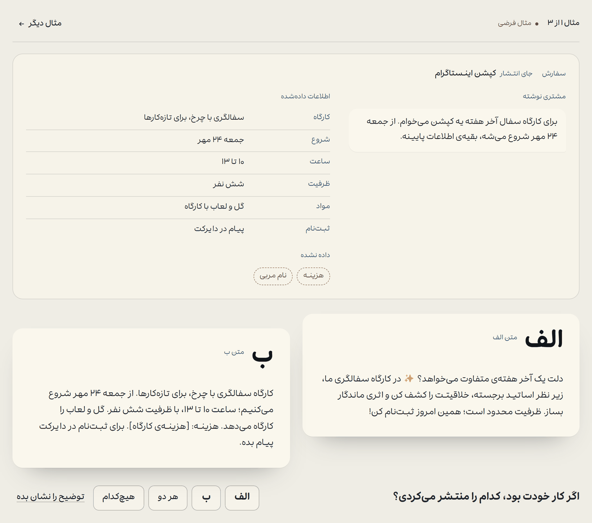
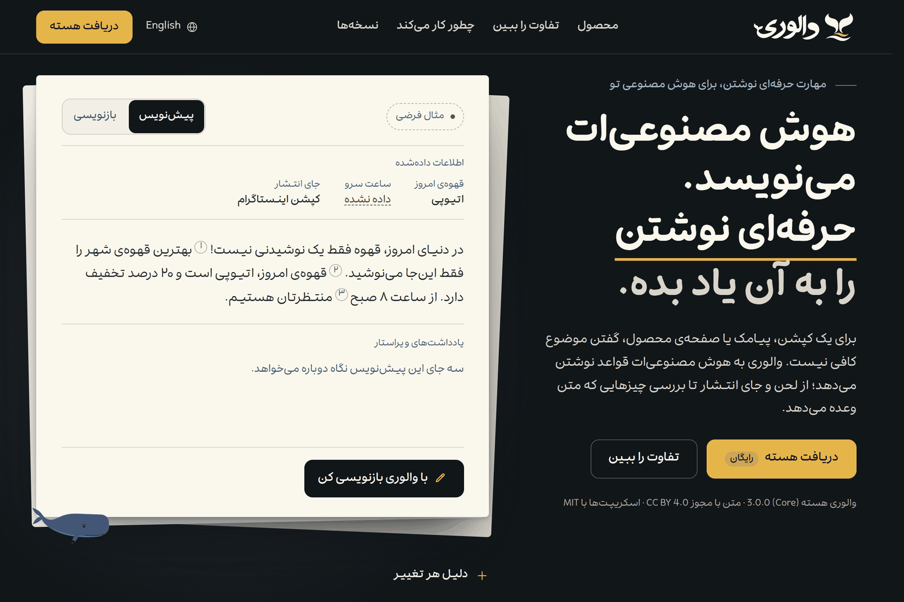
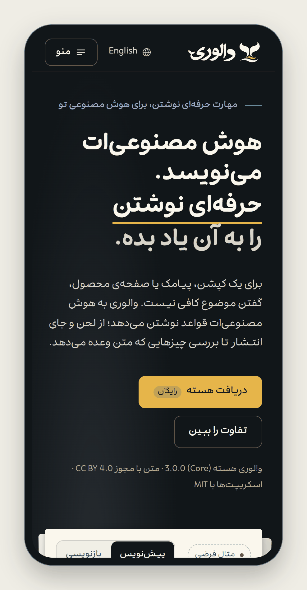

> نسخه‌ی آزمایشی عمومی: 3.2.0. بسته‌های هسته از انتشار برچسب‌خورده‌ی GitHub قابل دریافت‌اند. این نسخه پایدار نیست؛ همگام‌سازی هاب با ریشه‌ی آزمایشی غیرفعال می‌ماند.

<a id="readme-top"></a>

<div dir="rtl">

<div align="center">

<a href="https://whalory.com/fa/">
  <picture>
    <source media="(prefers-color-scheme: dark)" srcset="docs/assets/brand/whalory-fa-horizontal-reverse.svg">
    
  </picture>
</a>

<h3>والوری؛ به قلمِ خودت.</h3>

والوری به همان هوش مصنوعی‌ای که با آن کار می‌کنی، روش کار یک نویسنده‌ی حرفه‌ای را می‌دهد. برای هر برند پروفایل صدا نگه می‌دارد و متن فارسی و انگلیسی را با لینترهایی روی رایانه‌ی خودت می‌سنجد.

<p><a href="README.md">English</a> · <b>فارسی</b></p>

<p dir="ltr">
  <a href="CHANGELOG.md"></a>
  <a href="#fa-license"></a>
  
</p>

<br>

<a href="https://whalory.com/fa/">
  <picture>
    <source media="(prefers-reduced-motion: reduce)" srcset="docs/assets/fa-demo-hero.png">
    
  </picture>
</a>

<br><br>

**والوری پیش از نوشتن، سفارش را می‌خواند.** حداکثر سه پرسش می‌پرسد، آن هم فقط وقتی جوابش متن را عوض کند. از اطلاعاتی که داده‌ای بیرون نمی‌رود و جای هر چیز نامعلوم را با کروشه نشان می‌دهد، مثل «[ساعت سرو تأیید شود]». بعد لینترها پیش‌نویس را روی رایانه‌ی خودت می‌سنجند و متن از یک دور بازبینی کور هم می‌گذرد. والوری هسته رایگان است و مجوز باز دارد.

برای هفت دستیار، از Claude Code تا Copilot در VS Code، راه نصب دارد. هر دستیار گفت‌وگوی دیگری هم می‌تواند آن را به شکل متنی چسباندنی بگیرد.

<br>

**[دریافت والوری هسته](https://github.com/gilebehnam/whalory/releases/tag/v3.0.0)** · [راهنمای نصب هر دستیار](https://whalory.com/fa/download/)

</div>

در Claude Code همین مخزن بازارچه‌ی افزونه‌ی خودش است:

<div dir="ltr">

```bash
claude plugin marketplace add gilebehnam/whalory
claude plugin install whalory@whalory
```

</div>

<div align="center">

<sub>در ویندوز، <code dir="ltr">--config python=python</code> را به فرمان نصب اضافه کن. راه نصب بقیه‌ی دستیارها در <a href="#fa-start">شروع کار</a> آمده است.</sub>

<sub><b>والوری حرفه‌ای و استودیو</b> همه‌ی دستورهای کار، فایل‌های بازار، برگردان معنامحور، چهار عامل و چهار ابزار دیگر اضافه می‌کنند. حرفه‌ای با یک‌بار پرداخت ۷۹۰٬۰۰۰ تومان است و استودیو سالی ۴٬۵۰۰٬۰۰۰ تومان. درگاه پرداخت هنوز باز نشده است؛ تا آن موقع می‌توانی در <a href="https://whalory.com/fa/pricing/">فهرست انتظار</a> نام بنویسی.</sub>

</div>

---

> [!NOTE]
> **والوری مدل زبانی خودش را ندارد.** درون همان دستیاری کار می‌کند که الان داری: نوشتن با دستیار توست و روش، پروفایل صدا و بررسی‌ها با والوری. لینترها و سرور MCP روی رایانه‌ی خودت اجرا می‌شوند و به اینترنت وصل نمی‌شوند. مطالعه‌ای که قرار است اثر والوری را بسنجد طراحی شده ولی هنوز اجرا نشده است. برای همین این صفحه هیچ نمره‌ای نشان نمی‌دهد.

## فهرست

- [کجا نصب می‌شود](#fa-hosts)
- [والوری چیست](#fa-what)
- [چطور کار می‌کند](#fa-how)
- [قابلیت‌ها](#fa-features)
- [نسخه‌ها و قیمت](#fa-pricing)
- [شروع کار](#fa-start)
- [چرخه‌ی کیفیت](#fa-quality)
- [سنجش](#fa-benchmark)
- [حریم خصوصی و اینترنت](#fa-privacy)
- [نقشه‌ی راه](#fa-roadmap)
- [مشارکت](#fa-contributing)
- [امنیت](#fa-security)
- [مجوز](#fa-license)
- [سپاس](#fa-thanks)

<a id="fa-hosts"></a>

## کجا نصب می‌شود

**همان دستیاری را نگه دار که با آن کار می‌کنی.** هر راه نصب در این جدول بسته‌ای است که ساخت نامزد آزمایشی عمومی <span dir="ltr">3.2.0</span> تحویل می‌دهد. راهی را «آزموده» می‌نامیم که آزمونی تاریخ‌دار از ابتدا تا انتها داشته باشد. تا آن موقع، راهنمای هر دستیار فقط می‌گوید که راه نصب با مستندات خود آن دستیار سنجیده شده است. ستون آخر تازه‌ترین آزمون را نشان می‌دهد که روی ساخت نسخه‌ی <span dir="ltr">3.0.0</span> انجام شد.

<p dir="ltr">
  <a href="https://whalory.com/fa/guides/claude-code/"><kbd>Claude Code</kbd></a>
  <a href="https://whalory.com/fa/download/"><kbd>Claude Desktop</kbd></a>
  <a href="https://whalory.com/fa/download/"><kbd>claude.ai</kbd></a>
  <a href="https://whalory.com/fa/guides/codex/"><kbd>Codex</kbd></a>
  <a href="https://whalory.com/fa/guides/cursor/"><kbd>Cursor</kbd></a>
  <a href="https://whalory.com/fa/guides/vscode-copilot/"><kbd>VS Code · GitHub Copilot</kbd></a>
  <a href="https://whalory.com/fa/guides/gemini-cli/"><kbd>Gemini CLI</kbd></a>
  <a href="https://whalory.com/fa/download/"><kbd dir="rtl">+ هر گفت‌وگو، با چسباندن متن</kbd></a>
</p>

| دستیار | والوری هسته (رایگان) | آنچه حرفه‌ای اضافه می‌کند | تازه‌ترین آزمون |
|---|---|---|---|
| Claude Code | افزونه از همین مخزن، با عامل نویسنده و ویراستار، هشت فرمان و ابزارهای MCP؛ یا پوشه‌ی اسکیل | چهار عامل و سه فرمان دیگر، با بازارچه‌ی خصوصی | در Claude Code نسخه‌ی <span dir="ltr">2.1.278</span> افزونه بار شد و سرور MCP آن وصل بود. نصب از بازارچه هنوز اجرا نشده بود. |
| Claude Desktop | افزونه‌ی <span dir="ltr">.mcpb</span> با شش ابزار، همراه با بارگذاری اسکیل در claude.ai | چهار ابزار دیگر | آزمونی از ابتدا تا انتها ثبت نشده است |
| claude.ai | بارگذاری اسکیل (<span dir="ltr">-claudeai.zip</span>)؛ اجرای کد باید روشن باشد | همه‌ی فایل‌های مرجع | هنوز با بارگذاری واقعی آزموده نشده است |
| Codex | پوشه‌ی اسکیل، یا بسته‌ی Agent Plugins | سه فرمان دیگر، در بسته‌ی Agent Plugins | در codex-cli نسخه‌ی <span dir="ltr">0.145.0</span> اسکیل‌ها بار شدند. سرور MCP افزونه فقط از <span dir="ltr">.mcp.json</span> قدیمی بالا آمد و پوشه‌ی پروژه را نگرفت. |
| Cursor | پوشه‌ی اسکیل، با ابزارها در <span dir="ltr">.cursor/mcp.json</span> | افزونه‌ی Cursor با عامل‌ها | آزمونی از ابتدا تا انتها ثبت نشده است |
| VS Code با GitHub Copilot | بسته‌ی Agent Plugins، یا پوشه‌ی اسکیل | همه‌ی عامل‌ها | وقت ساخت نسخه‌ی <span dir="ltr">3.0.0</span> هیچ‌کدام از دو راه افزونه آزموده نشده بود |
| Gemini CLI | پوشه‌ی اسکیل. افزونه‌ای با عامل‌ها ساخته شده، ولی مخزنش هنوز منتشر نشده است. | همه‌ی عامل‌ها، در همان افزونه | آزمونی از ابتدا تا انتها ثبت نشده است |
| هر گفت‌وگو | متن چسباندنی در دو اندازه‌ی ۱٬۵۰۰ و ۴٬۰۰۰ نویسه، به فارسی و انگلیسی | متن ۸٬۰۰۰ نویسه‌ای؛ بسته‌های آماده برای Custom GPT، پروژه‌های ChatGPT&rlm;، Gemini Gems و اپ Gemini؛ قاعده‌های ویرایشگر و مخزن | نصب نمی‌خواهد. اسکریپتی اجرا نمی‌شود و بررسی دستی است. |

هر دستیاری که اسکیل‌ها را از <span dir="ltr">.agents/skills/</span> می‌خواند، با همین پوشه کار می‌کند. جدول کامل سازگاری، ستون به ستون، در [صفحه‌ی دریافت](https://whalory.com/fa/download/) است.

<div align="left">(<a href="#readme-top">بازگشت به بالا</a>)</div>

<a id="fa-what"></a>

## والوری چیست

والوری مجموعه‌ای از فایل‌هاست که دستیارت می‌خواند، به‌علاوه‌ی چند برنامه‌ی کوچک که می‌تواند اجرا کند. مدل همان است که خودت انتخاب کرده‌ای.

| بخش | کارش |
|---|---|
| روش کار | پیش از نوشتن، کار، جای انتشار، خواننده و زبان خروجی را روشن می‌کند. حداکثر سه پرسش کوتاه می‌پرسد و کنار هر کدام جوابی پیشنهادی می‌گذارد. اگر بنویسی «بنویس»، بی‌پرسش شروع می‌کند. |
| دستور کار | هر کار دستور کار خودش را دارد. دستورهای کار هسته این کارها را می‌پوشانند: کپشن، پست شبکه‌های اجتماعی، شعار، پیامک، ایمیل، پاسخ به مشتری و معرفی محصول. ریزمتن رابط، پیام خطا، صفحه‌ی درباره‌ی ما، تعمیر سبک، بازبینی و پروفایل صدا هم در همین فهرست‌اند. |
| سه قاعده‌ی ثابت | چیزی ساخته نمی‌شود: عدد، نقل‌قول، نظر مشتری و نتیجه فقط از اطلاعات تو می‌آید. الگوهای ماشینی کنار می‌روند، مثل تقابل ساختگی یا نتیجه‌گیری اخلاقی. هر ادعا مدرکی می‌خواهد که برند بتواند نشان دهد؛ وگرنه در کروشه می‌ماند. |
| پروفایل صدا | <span dir="ltr">VOICE.md</span> و <span dir="ltr">voice.json</span> لحن برند، واژه‌های مجاز و ممنوع، گونه‌ی املایی و سقف‌هایش را نگه می‌دارند. والوری در هر کار پروفایل را می‌خواند، همراه با یادداشت <span dir="ltr">LEARNINGS.md</span> که کنارش است. |
| دو زبان | فارسی با نیم‌فاصله، رقم فارسی، گیومه‌ی «» و ی و ک فارسی. انگلیسی به‌طور پیش‌فرض آمریکایی است و پروفایل می‌تواند گونه‌ی بریتانیایی، استرالیایی، کانادایی، نیوزیلندی، ایرلندی یا هندی را انتخاب کند. |
| لینتر محلی | <span dir="ltr">lint.py</span> زبان هر سطر را تشخیص می‌دهد. بعد هر سطر به <span dir="ltr">lint_fa.py</span> یا <span dir="ltr">lint_en.py</span> می‌رود. نشانه‌های ماشینی، اغراق، املا، طول جمله، خوانایی و سقف نویسه‌ی هر جای انتشار سنجیده می‌شود. |
| ویراستار کور | در افزونه‌ی Claude Code، عامل دومی هر پیش‌نویس را بازبینی می‌کند. پیش‌نویس، اطلاعات، پروفایل و قالب را می‌بیند و استدلال نویسنده به دستش نمی‌رسد. در دستیارهای دیگر، همان مدل این بازبینی را در دوری جدا انجام می‌دهد. |
| سرور MCP | یک فایل پایتون که از راه ورودی و خروجی استاندارد کار می‌کند و در هسته شش ابزار دارد. هیچ اتصال شبکه‌ای باز نمی‌کند. فایلی هم نمی‌نویسد، جز شمارش‌هایی در پوشه‌ی هاب، آن هم وقتی آمار یا بسته‌ی هفتگی هاب را خودت روشن کرده باشی. |
| هاب والوری | قاعده‌ها را میان دو نسخه به‌روز نگه می‌دارد. افزونه‌ها با شروع هر جلسه برنامه‌ی هاب را اجرا می‌کنند. فایل‌های قاعده‌ای که والوری امضا کرده، روزی یک بار با همین برنامه دانلود می‌شوند. برنامه پیش از آن‌که لینترها سراغشان بروند، همه‌ی امضاها را می‌سنجد. هم‌رسانی شمارش‌ها با والوری خاموش می‌ماند، مگر خودت در ترمینال خودت روشنش کنی. |

<a id="fa-how"></a>

## چطور کار می‌کند

<p align="center"><b>سفارش ← پیش‌نویس با روش والوری ← لینتر روی رایانه‌ی تو ← ویراستار کور ← بازنویسی ← تحویل</b></p>

۱. سفارش را می‌خواند. زبان خروجی به ترتیبی ثابت روشن می‌شود: اول دستور خودت، بعد جای انتشار یا بازار، بعد متنی که داده‌ای و بعد زبان درخواستت. پروفایل آخر از همه تصمیم می‌گیرد.\
۲. در حد اطلاعات می‌نویسد. دستور کار شکل متن را معلوم می‌کند و لحن از پروفایل می‌آید. چیزی که کسی نداده، پیدا می‌ماند؛ مثل «[وزن تأیید شود]».\
۳. با لینتر می‌سنجد. یک متن همیشه همان نتیجه را می‌دهد؛ قاعده یا ایراد می‌گیرد یا نمی‌گیرد. اگر پایتون نباشد، والوری فهرست بررسی دستی را طی می‌کند و در یادداشتش به آن اشاره می‌کند.\
۴. کور بازبینی می‌کند. ویراستار ندیده متن چطور نوشته شده، پس آن را همان‌طور می‌خواند که مشتری می‌خواند. در افزونه‌ی Claude Code این ویراستار عامل دوم است و جاهای دیگر، دور جدایی از همان مدل.\
۵. تحویل می‌دهد. اول متن می‌آید، بعد یادداشتی کوتاه که با «تشخیص:» شروع می‌شود و می‌گوید چه عوض شد و چه چیزی هنوز باید تأیید شود.

<div align="left">(<a href="#readme-top">بازگشت به بالا</a>)</div>

<a id="fa-features"></a>

## قابلیت‌ها

<table>
<tr>
<td width="50%" valign="middle">

### یک سفارش، سه جای انتشار

کافه نارون یک ساعت زودتر باز می‌کند. از همین خبر، کپشن اینستاگرام، پیامک و متن صفحه‌ی وب درمی‌آید و هر کدام همان شکلی را دارد که جای انتشارش می‌خواهد. تاریخ شروع را کسی نداده، پس در هر سه متن جای خالی می‌ماند.

<sub>مثال‌های سایت کار تیم والوری است و برای نشان‌دادن روش نوشته شده. برچسب هر مثال هم همین را می‌گوید. هیچ‌کدام خروجی مدل نیست.</sub>

</td>
<td width="50%">
  
</td>
</tr>
<tr>
<td width="50%" valign="middle">

### پیش از برچسب بخوان

دو پیش‌نویس از یک سفارش می‌بینی، با نام «الف» و «ب». اول انتخاب می‌کنی کدام را منتشر می‌کردی و بعد می‌فهمی کدام با روش والوری نوشته شده. سایت هیچ انتخابی را جمع نمی‌کند و درصد برد منتشر نمی‌کند.

</td>
<td width="50%">
  
</td>
</tr>
<tr>
<td width="50%" valign="middle">

### فارسی، با وسواس

فارسی این‌جا زبان اول است، با فایل‌های نگارش و لینتر خودش. نیم‌فاصله، رقم فارسی، گیومه و شکل فارسی ی و ک را می‌سنجد؛ همان‌ها که از صفحه‌کلیدهای دیگر اشتباه وارد می‌شوند.

</td>
<td width="50%">
  
</td>
</tr>
<tr>
<td width="50%" valign="middle">

### روی گوشی هم امتحانش کن

صفحه‌ی اصلی سایت روش را روی پیش‌نویسی آماده اجرا می‌کند. دکمه‌ی «با والوری بازنویسی کن» را بزن تا هر تغییر با دلیلش بیاید. در عرض گوشی هم کار می‌کند.

</td>
<td width="50%" align="center">
  
</td>
</tr>
</table>

### یک اجرای واقعی لینتر

این سفارش یک کافه است و این هم پیش‌نویسی که به آن وفادار نمانده. خروجی زیر را از اجرای واقعی <span dir="ltr">lint.py</span> نسخه‌ی <span dir="ltr">3.1.0</span> برداشته‌ایم.

سفارش (<span dir="ltr">brief.txt</span>):

```text
کافه نارون از شنبه ساعت ۷ صبح باز می‌کند، یک ساعت زودتر از قبل. قهوه‌ی بیرون‌بر از پنجره‌ی کناری سرو می‌شود.
```

پیش‌نویس (<span dir="ltr">draft.txt</span>):

```text
در دنیای پرشتاب امروز، کافه نارون فقط یک کافه نیست، بلکه تجربه‌ای بی‌نظیر است! از شنبه ساعت ۷ صبح منتظرتان هستیم و بهترین قهوه‌ی شهر را با ۲۰ درصد تخفیف سرو می‌کنیم.
```

<div dir="ltr">

```console
$ python skills/whalory/scripts/lint.py draft.txt
draft.txt:1:1  error   world-today        شروعِ کلیشه «دنیای امروز»  «در دنیای پرشتاب امروز، کافه نارون فق»
draft.txt:1:35  error   just-not           تقابلِ «فقط یک... نیست»  «وز، کافه نارون فقط یک کافه نیست، بلکه تجربه‌ای»
draft.txt:1:47  error   neg-contrast       تقابلِ منفی «X نیستیم، Y هستیم»  «ون فقط یک کافه نیست، بلکه تجربه‌ای بی‌نظیر است! از شنبه ساعت»
draft.txt:1:58  error   unique-exp         کلیشه «تجربه‌ای بی‌نظیر»  «افه نیست، بلکه تجربه‌ای بی‌نظیر است! از شنبه س»
draft.txt  warning bangs              علامتِ تعجب 1 بار؛ سقف 0
draft.txt:1:67  warning lexicon            واژه‌ی صفتِ بزرگ: «بی‌نظیر»؛ با جزئیات عوض کن یا حذف کن  «بلکه تجربه‌ای بی‌نظیر است! از شنبه س»
draft.txt:1:116  warning lexicon            واژه‌ی صفتِ بزرگ: «بهترین»؛ با جزئیات عوض کن یا حذف کن  «تظرتان هستیم و بهترین قهوه‌ی شهر را»
draft.txt: [fa] 2 جمله، میانگینِ 16.0 واژه، سقفِ 24 · 4 خطا · 3 هشدار
```

</div>

با چهار خطا، کد خروج لینتر ۱ است و کار خودکار در CI همین‌جا شکست می‌خورد. قلاب لینتر جلوی ویرایش را نمی‌گیرد. فقط خطا را به دستیار گزارش می‌دهد. یک چیز را هم این اجرا نگرفته است: تخفیف ۲۰ درصدی در سفارش نیامده. سنجش واقعیت‌ها با سفارش (گزینه‌ی <span dir="ltr">--facts</span>) فعلاً فقط برای متن انگلیسی کار می‌کند. در متن فارسی، ویراستار کور پیش‌نویس را با فهرست اطلاعات می‌سنجد. ادعایی مثل همین تخفیف در همان بازبینی پیدا می‌شود.

### آنچه رایگان می‌گیری

- روش: تشخیص موقعیت، دروازه‌ی پرسش با حداکثر سه پرسش و دستور کار برای کارهای پرتکرار. فهرست کارها درخواست را به هر دو زبان می‌شناسد.
- صدا: قالب پروفایل به دو زبان، صدای خود والوری به‌عنوان نمونه و پروفایل‌های آغازین کافه و نرم‌افزار در هر زبان. پروفایلت در پروژه یا در <span dir="ltr">~/.whalory/profiles/</span> می‌ماند و هیچ به‌روزرسانی‌ای رویش نمی‌نویسد.
- بررسی: سه لینتر، با گزینه‌های قالب، جای انتشار، پروفایل، گونه‌ی زبان، خروجی JSON و اصلاح خودکار. <span dir="ltr">textcount.py</span> نویسه، نویسه‌ی وزن‌دار X و پاره‌ی پیامک را می‌شمارد.
- آزمون خودکار: <span dir="ltr">selftest.py</span> آزمون‌های فارسی، انگلیسی و MCP را اجرا می‌کند.
- افزونه: عامل نویسنده و ویراستار، با هشت فرمان برای نوشتن، بازبینی، ساختن پروفایل صدا، لینتر، ثبت درس، مرور درس‌ها، هاب و بسته‌ی بازخورد.
- ابزارها: شش ابزار MCP برای لینتر، بررسی نهایی متن تأییدشده، دستور کار، بخش‌های مرجع و پیدا کردن پروفایل.
- به‌روزرسانی قاعده‌ها: افزونه‌ها با برنامه‌ی هاب روزی یک بار فایل‌های امضاشده‌ی قاعده را می‌گیرند. فرمان <span dir="ltr">status</span> قاعده‌های فعال را نشان می‌دهد، <span dir="ltr">pin</span> ثابتشان نگه می‌دارد و <span dir="ltr">rollback</span> به مجموعه‌ی قبلی برمی‌گردد.
- لینتر پس از هر ویرایش، اگر بخواهی: افزونه‌ی جداگانه‌ی <span dir="ltr">whalory-autolint</span> فایل‌های محتوا و زبان رابط را بعد از هر ویرایش می‌سنجد.

<div align="left">(<a href="#readme-top">بازگشت به بالا</a>)</div>

<a id="fa-pricing"></a>

## نسخه‌ها و قیمت

| نسخه | قیمت | برای چه کسی | چه اضافه می‌کند |
|---|---|---|---|
| والوری هسته | رایگان | همه، کار تجاری هم | هر چه در همین مخزن هست |
| والوری حرفه‌ای | ۷۹۰٬۰۰۰ تومان، یک‌بار | یک نفر، با ۱۲ ماه نسخه‌ی تازه | همه‌ی دستورهای کار با زنجیره‌های چندکاناله؛ همه‌ی فایل‌های نگارش و بازار؛ چهار عامل دیگر؛ روی هم ده ابزار MCP؛ همه‌ی بسته‌های نصب |
| والوری استودیو | ۴٬۵۰۰٬۰۰۰ تومان در سال | حداکثر ۵ نفر در یک سازمان | همه‌ی حرفه‌ای، برای مخزن یا فضای کاری مشترکی که فقط همان افراد به آن دسترسی دارند |
| تمدید به‌روزرسانی حرفه‌ای | ۴۹۰٬۰۰۰ تومان | دارنده‌ی لایسنس حرفه‌ای | ۱۲ ماه نسخه‌ی تازه‌ی دیگر، با همان کلید لایسنس |

پرداخت با کارت بانکی ایرانی و از درگاه زرین‌پال است. درگاه هنوز باز نشده است و وقتی باز می‌شود که راه‌اندازی‌اش تمام شود. تا آن موقع [صفحه‌ی قیمت](https://whalory.com/fa/pricing/) فهرست انتظار دارد و هیچ پولی نمی‌گیرد. خبر باز شدن پرداخت در همین مخزن می‌آید. پرداخت با کارتی که بیرون از ایران صادر شده هم در برنامه است و فهرست انتظار خودش را دارد.

هر نسخه‌ی حرفه‌ای که بگیری، بعد از آن ۱۲ ماه هم کار می‌کند. وضع استودیو بعد از پایان سال هنوز روشن نیست. توافق‌نامه‌ی حرفه‌ای و استودیو هنوز پیش‌نویس است و شرط بازگشت پول هم هنوز تعیین نشده.

<a id="fa-start"></a>

## شروع کار

نسخه‌ی پایدار پیشین [3.0.0](https://github.com/gilebehnam/whalory/releases/tag/v3.0.0) است. [نامزد 3.2.0](https://github.com/gilebehnam/whalory/releases/tag/v3.2.0) همراه بسته‌های هسته و SHA256SUMS به‌صورت آزمایشی عمومی منتشر شده است. پیش از نصب، راهنما و حدود آزمون هر میزبان را بخوانید.

| دستیار | از این‌جا شروع کن |
|---|---|
| Claude Code | دو فرمان بالای همین صفحه |
| Claude Desktop | <span dir="ltr">whalory-core-mcp-3.2.0.mcpb</span> برای ابزارها، و <span dir="ltr">whalory-core-3.2.0-claudeai.zip</span> در <span dir="ltr">Customize > Skills</span> برای روش |
| claude.ai | اجرای کد را روشن کن. بعد <span dir="ltr">whalory-core-3.2.0-claudeai.zip</span> را در <span dir="ltr">Customize > Skills</span> بارگذاری کن |
| Codex | پوشه‌ی <span dir="ltr">skills/whalory</span> را در <span dir="ltr">~/.agents/skills/</span> کپی کن و با <span dir="ltr">$whalory</span> صدایش بزن |
| Cursor | پوشه‌ی <span dir="ltr">skills/whalory</span> را در <span dir="ltr">.cursor/skills/</span> کپی کن. بعد ابزارها را در <span dir="ltr">.cursor/mcp.json</span> اضافه کن |
| VS Code با Copilot | <span dir="ltr">whalory-core-3.2.0-agent-plugin.zip</span> را باز کن. بعد پوشه‌اش را به <span dir="ltr">chat.pluginLocations</span> اضافه کن |
| Gemini CLI | <span dir="ltr">whalory-core-3.2.0-skill.zip</span> را در <span dir="ltr">~/.gemini/skills/</span> باز کن. وقتی Gemini برای فعال کردن اسکیل اجازه خواست، تأیید کن |
| هر گفت‌وگو | یکی از متن‌های <span dir="ltr">whalory-core-3.2.0-paste.zip</span> را در دستورهای سفارشی دستیار بچسبان |

لینترها و سرور MCP با پایتون <span dir="ltr">3.8</span> یا تازه‌تر اجرا می‌شوند. بی‌پایتون هم اسکیل کار می‌کند و بررسی را دستی انجام می‌دهد.

برای آزمودن نصب، به دستیارت بگو: «یک کپشن برای معرفی [محصول] بنویس.» باید یک تا سه پرسش کوتاه برسد، یا کپشن همراه با یادداشتی که با «تشخیص:» شروع می‌شود. اطلاعات نامعلوم در کروشه می‌مانند.

<a id="fa-quality"></a>

## چرخه‌ی کیفیت

هر پیش‌نویس پیش از آن‌که به دستت برسد از این چرخه می‌گذرد. در افزونه‌ی Claude Code بازبینی را عامل دوم انجام می‌دهد و در دستیارهای دیگر، همان مدل در دوری جدا.

۱. لینتر. خطا جلوی تحویل را می‌گیرد: عدد ساختگی، ی و ک عربی یا سقف شکسته‌ی جای انتشار. هشدارها به ویراستار می‌رسند.\
۲. بازبینی کور. ویراستار با جدولی ۲۰ نمره‌ای پیش‌نویس را با سفارش می‌سنجد. فهرست اصلاح‌ها هم همراه نمره برمی‌گردد. فرمان بازبینی همین کار را روی هر فایل یا متن چسبانده‌شده‌ای انجام می‌دهد.\
۳. بازنویسی و لینتر دوباره، حداکثر در دو دور. پیش‌نویس وقتی آماده است که لینتر خطایی نبیند و نمره‌اش دست‌کم ۱۷ باشد. اگر پایتون نباشد، یادداشت می‌گوید بررسی دستی بوده است.\
۴. تحویل با یادداشت. یادداشت می‌گوید چه عوض شد و چه چیزی هنوز باز است. در صنعت‌های پرخطر، می‌گوید پیش از انتشار چه چیزی را تأیید کنی.

کد خروج لینتر بی‌خطا ۰ است، با خطا ۱ و با ورودی نادرست ۲. پس هر سامانه‌ی آزمون خودکاری می‌تواند اجرایش کند و گزینه‌ی <span dir="ltr">--strict</span> هشدار را هم خطا حساب می‌کند. نمونه‌ی آماده برای GitHub Actions و pre-commit در [راهنمای اسکیل](skills/whalory/GUIDE.fa.md) هست.

<a id="fa-benchmark"></a>

## سنجش

**وضعیت: هنوز اجرا نشده.** مطالعه طراحی شده و شیوه‌نامه‌اش ثابت شده است. هیچ مدلی اجرا نشده، پس نتیجه‌ای هم وجود ندارد.

- پرسش: با سفارشی یکسان، آیا مدلی که از والوری پیروی می‌کند متنی نزدیک‌تر به کار نویسنده‌ی حرفه‌ای می‌نویسد؟ مقایسه با همان مدل است، وقتی فقط سفارش را دارد.
- طرح: ۵۲ سفارش، نیمی فارسی و نیمی انگلیسی، از کم‌خطر تا پرخطر. دو حالت فقط در اسکیل با هم فرق دارند و از هر سفارش در هر حالت سه نمونه گرفته می‌شود؛ یعنی ۳۱۲ پیش‌نویس و ۱۵۶ جفت کور. داوری را کسانی می‌کنند که در ساخت والوری نقشی نداشته‌اند. مدل‌هایی از خانواده‌های دیگر هم داوری می‌کنند.
- قاعده‌ی تصمیم: برای هر زبان از پیش تعیین شده است. نتیجه یکی از این‌هاست: بهتر، بدتر، بی‌نتیجه، یا «تفاوت قابل تشخیصی دیده نشد».
- گزارش: هر چه باشد منتشر می‌شود، حتی مساوی و باخت، با شناسه‌ی مدل و تاریخ اجرا.

نسخه‌ی <span dir="ltr">1.1</span> شیوه‌نامه در ۶ مهر ۱۴۰۵، پیش از هر اجرا، ثابت شد. طرح کامل در [صفحه‌ی شواهد](https://whalory.com/fa/evidence/) است.

<a id="fa-privacy"></a>

## حریم خصوصی و اینترنت

- لینترها، سرور MCP و قلاب لینتر روی رایانه‌ی خودت اجرا می‌شوند و به اینترنت وصل نمی‌شوند. متنی که می‌نویسی از راه والوری از رایانه‌ات بیرون نمی‌رود.
- فقط یک بخش از اینترنت استفاده می‌کند: برنامه‌ی هاب، که افزونه‌ها با شروع هر جلسه اجرایش می‌کنند. روزی یک بار فایل‌های امضاشده‌ی قاعده را دانلود می‌کند و هیچ شناسه‌ای همراه درخواست نمی‌فرستد. مثل هر سرور وب، آینه‌ای که جواب می‌دهد نشانی IP تو را می‌بیند. فرمان <span dir="ltr">python skills/whalory/scripts/hub_client.py off updates</span> این دانلود را خاموش می‌کند. با <span dir="ltr">WHALORY_HUB=0</span> هم کل هاب خاموش می‌شود.
- آمار قاعده‌ها و بسته‌ی هفتگی به‌طور پیش‌فرض خاموش‌اند. بسته هم می‌مانند تا والوری با تنظیمی امضاشده بازشان کند؛ این کار پس از بازبینی حقوقی متن‌هایشان انجام می‌شود. آن وقت هم فقط خودت، با نوشتن کدی در ترمینال خودت، می‌توانی یکی را روشن کنی.
- فایل‌هایت را فقط وقتی خودت بخواهی تغییر می‌دهد. <span dir="ltr">lint.py --fix</span> نسخه‌ی اصلاح‌شده را کنار فایل اصلی ذخیره می‌کند و با <span dir="ltr">--write</span> خود فایل اصلاح می‌شود.
- دستیارت سرویسی جداست و متن تو را طبق شرایط خودش پردازش می‌کند.

جزئیات، از همه‌ی کلیدهای خاموش‌کردن تا آنچه هاب روی رایانه‌ات نگه می‌دارد، در [PRIVACY.md](PRIVACY.md) آمده است.

<div align="left">(<a href="#readme-top">بازگشت به بالا</a>)</div>

<a id="fa-roadmap"></a>

## نقشه‌ی راه

نسخهٔ عمومی تأییدشده 3.0.0 است. پیش‌نسخهٔ توسعهٔ خصوصی 3.1.0، پیاده‌سازی موجود هاب، بررسی نهایی و درس‌های تأییدشدهٔ کاربر را دارد. نامزد 3.2.0 ادامهٔ همین منبع است و به‌صورت آزمایشی عمومی منتشر شده. تاریخچهٔ اصلاح‌شده در [CHANGELOG.md](CHANGELOG.md) آمده است.

قدم‌های بعدی:

- [ ] اجرای مطالعه‌ی سنجش و انتشار گزارشش، هر چه باشد.
- [ ] انتشار افزونه‌ی Gemini CLI در مخزن خودش.
- [ ] باز شدن آمار قاعده‌ها و بسته‌ی هفتگی، پس از بازبینی حقوقی متن‌هایشان. جزئیاتش در [مخزن هاب](https://github.com/gilebehnam/whalory-hub) است.
- [ ] آزمونی تاریخ‌دار از ابتدا تا انتها روی هر دستیار، که کنار هر راه نصب ثبت می‌شود.
- [ ] باز شدن درگاه پرداخت حرفه‌ای و استودیو؛ پرداخت با کارتی که بیرون از ایران صادر شده هم در برنامه است.

<a id="fa-contributing"></a>

## مشارکت

این کمک‌ها را با خوشحالی می‌پذیریم:

- گزارش ایرادی که لینتر بی‌جا گرفته؛
- قاعده‌ای که کم است؛
- تجربه‌ی نصب روی دستیاری تازه؛
- اصلاح مرجع‌های فارسی یا انگلیسی.

از [CONTRIBUTING.md](CONTRIBUTING.md) شروع کن. خلاصه‌اش سه کار است. متن دقیق و فرمان را در issue بگذار. فقط از کتابخانه‌ی استاندارد پایتون استفاده کن. پیش از درخواست ادغام هم <span dir="ltr">selftest.py</span> را اجرا کن. issue و درخواست ادغام را به فارسی هم می‌شود نوشت.

این مخزن از منبع والوری ساخته می‌شود. نگه‌دارنده‌ها تغییر پذیرفته‌شده را به منبع می‌برند و آن تغییر با انتشار بعدی، با نام تو در فهرست تغییرها، به این‌جا می‌رسد.

هر کس در این مخزن مشارکت کند [منشور رفتار](CODE_OF_CONDUCT.md) را پذیرفته است. برای پرسش‌ها [SUPPORT.md](SUPPORT.md) را ببین.

<a id="fa-security"></a>

## امنیت

آسیب‌پذیری را از راه خصوصی گیت‌هاب گزارش کن: [گزارش آسیب‌پذیری](https://github.com/gilebehnam/whalory/security/advisories/new). برایش issue عمومی باز نکن. دامنه و روند کار در [SECURITY.md](SECURITY.md) آمده است.

<a id="fa-license"></a>

## مجوز

والوری هسته برای همه رایگان است، کار تجاری هم.

- اسکریپت‌ها، یعنی هر فایلی که در پوشه‌ی <span dir="ltr">scripts/</span> است، با [مجوز MIT](LICENSE-MIT) منتشر می‌شوند.
- باقی فایل‌ها با [مجوز کریتیو کامنز، نسبت‌دادن ۴٫۰](LICENSE-CC-BY-4.0) منتشر می‌شوند: اسکیل، مرجع‌ها، پروفایل‌ها، عامل‌ها، فرمان‌ها و همین سندها.
- نام‌ها و نشان‌های «والوری»، Whalory&rlm;، «والیا» و Whalya مجوز ندارند. برای نام‌بردن از والوری آزاد هستی، ولی نسخه‌ی تغییریافته نام خودش را می‌گیرد.
- متنی که با والوری می‌نویسی مال خودت است و لازم نیست در آن از والوری نام ببری.

وقتی هسته را با دیگران هم‌رسانی می‌کنی، این‌طور نام ببر:

```text
بر پایه‌ی «والوری» (Whalory)، ساختِ استودیو والیا، https://github.com/gilebehnam/whalory، با مجوزِ CC BY 4.0 (https://creativecommons.org/licenses/by/4.0/). [بی‌تغییر / با تغییر: یک جمله درباره‌ی تغییر]
```

متن کامل شرایط در [LICENSE-CORE.md](LICENSE-CORE.md) و [LICENSE.md](LICENSE.md) است. فایل‌های حرفه‌ای و استودیو در این مخزن نیستند و مجوز پولی جداگانه‌ای دارند.

<a id="fa-thanks"></a>

## سپاس

سپاس‌گزار این‌ها هستیم:

- قالب‌های باز [Agent Skills](https://agentskills.io/) و [Model Context Protocol](https://modelcontextprotocol.io/)، که یک پوشه را برای دستیارهای زیادی به کار می‌آورند.
- مجوزهای [کریتیو کامنز](https://creativecommons.org/) و [MIT](https://opensource.org/license/mit).
- قراردادهای [Keep a Changelog](https://keepachangelog.com/en/1.1.0/) و [Semantic Versioning](https://semver.org/)، برای فهرست تغییرها و شماره‌ی نسخه‌ها.
- منشور [Contributor Covenant](https://www.contributor-covenant.org/)، که منشور رفتار ما بر پایه‌ی آن است.
- سرویس [Shields.io](https://shields.io/)، برای نشان‌ها.

<br>

<sub>این صفحه را هم، مثل همه‌ی متن‌های <span dir="ltr">whalory.com</span>&rlm;، به‌کلی با والوری نوشته‌ایم. هر بخش از یک سفارش کوتاه شروع شد و بی‌هیچ خطایی از لینتر گذشت. بعد همان هوش مصنوعی، در بازخوانی‌ای جدا، به آن دست‌کم ۱۷ از ۲۰ نمره داد. <a href="https://whalory.com/fa/#written-with-whalory">این سایت چطور نوشته شد</a></sub>

<br><br>

<div align="center">

<a href="https://whalory.com/fa/">
  <picture>
    <source media="(prefers-color-scheme: dark)" srcset="docs/assets/brand/whalory-b05-reverse.svg">
    
  </picture>
</a>

<sub>محصولی از والیا · © ۲۰۲۶ والیا</sub>

</div>

</div>
