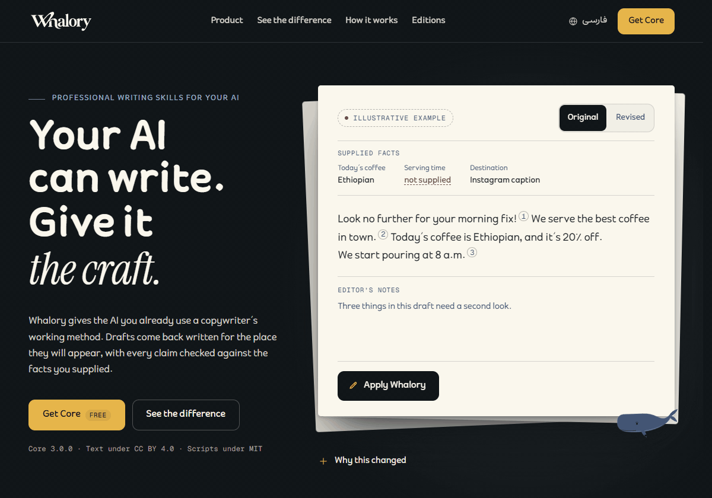
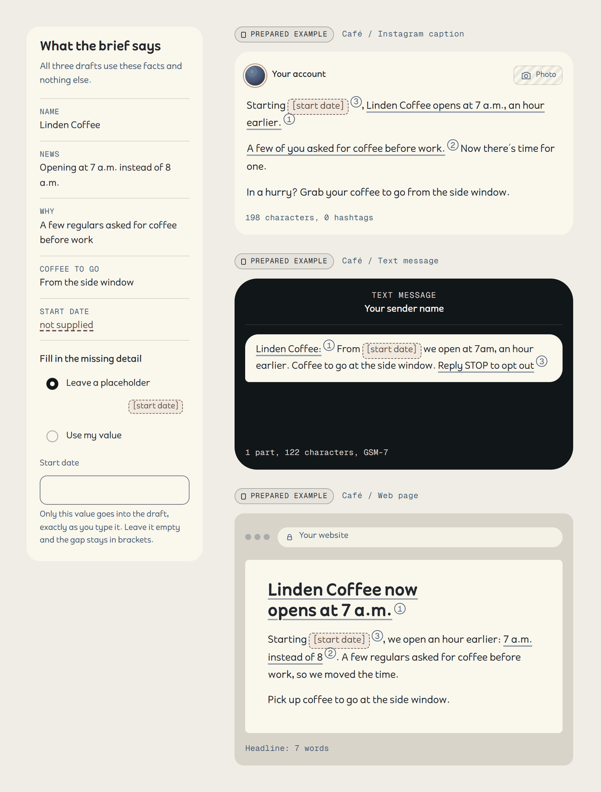
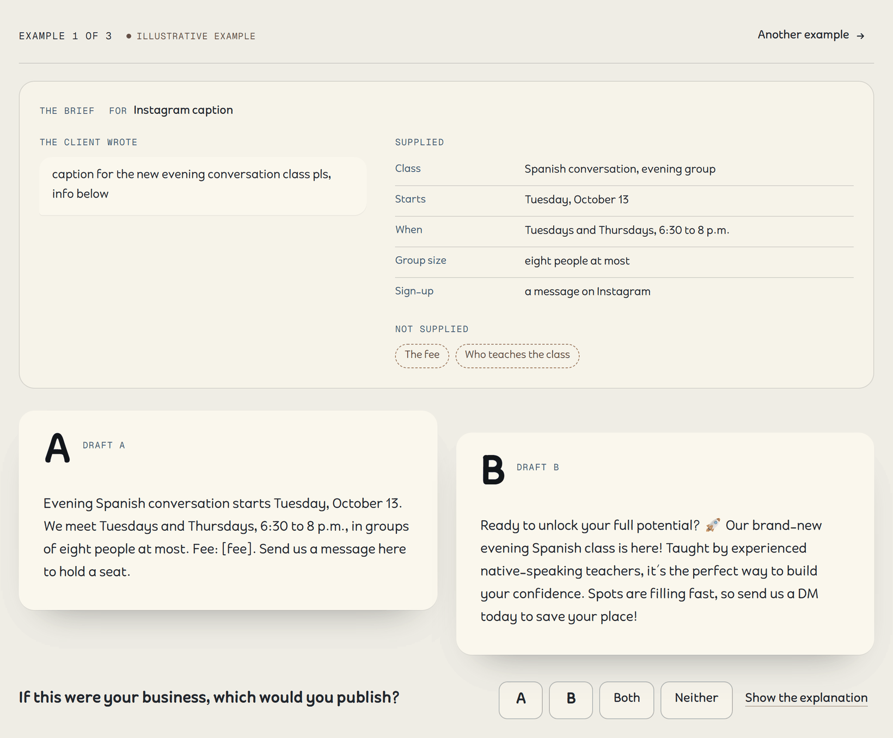
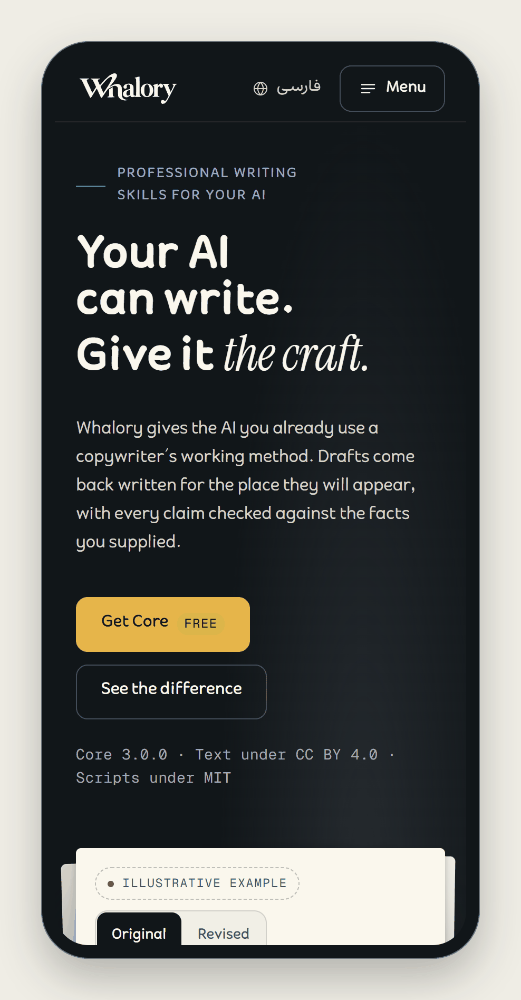

<a id="readme-top"></a>

<div align="center">

<a href="https://whalory.com/">
  <picture>
    <source media="(prefers-color-scheme: dark)" srcset="docs/assets/brand/whalory-wordmark-en-reverse.svg">
    
  </picture>
</a>

<h3>Your AI. Your voice.</h3>

Whalory gives the AI you already use a copywriter's working method and a voice profile for each brand. Its linters check English and Persian copy on your own machine.

<p><b>English</b> · <a href="README.fa.md">فارسی</a></p>

<p>
  <a href="#license"></a>
  <a href="CHANGELOG.md"></a>
  
  <a href="#where-it-installs"></a>
  
  <a href="#the-benchmark"></a>
</p>

<br>

<a href="https://whalory.com/">
  <picture>
    <source media="(prefers-reduced-motion: reduce)" srcset="docs/assets/demo-hero.png">
    
  </picture>
</a>

<br><br>

**Whalory reads the brief before it writes.** It asks at most three questions, and only when an answer would change the text. It keeps to the facts you supplied and marks each gap with a bracket, such as `[confirm: serving time]`. Then the linters check the draft on your machine, and a blind editor pass reviews it. Whalory Core is free, under open licenses.

It has an install route for Claude Code, Claude Desktop, claude.ai, Codex, Cursor, Gemini CLI, and GitHub Copilot in Visual Studio Code (VS Code). Any other chat assistant can take it as a pasted prompt.

<p><em>Agent Skills · Claude Code plugin · MCP over stdio · Python 3.8+ standard library · Markdown and JSON</em></p>

<br>

**[Download Whalory Core 3.1.0](https://github.com/gilebehnam/whalory/releases/latest)** · [Install guides for every host](https://whalory.com/download/)

</div>

In Claude Code, this repository is its own plugin marketplace:

```bash
claude plugin marketplace add gilebehnam/whalory
claude plugin install whalory@whalory
```

<div align="center">

<sub>On Windows, add <code>--config python=python</code> to the install command. Every other host is in <a href="docs/INSTALL.md">docs/INSTALL.md</a>.</sub>

<sub><b>Whalory Pro and Studio</b> add every playbook, the market files, transcreation, four more agents, and four more MCP tools. Pro costs $29 once, and Studio $199 a year. International checkout isn't open yet: <a href="https://whalory.com/pricing/">join the waitlist</a>, and nothing is charged until it opens.</sub>

</div>

---

> [!NOTE]
> **Whalory has no model of its own.** It works inside the assistant you already use: your assistant writes, and Whalory brings the method, the voice profile, and the checks. The linters and the MCP server run on your machine and make no network calls. The study that will measure what Whalory changes is designed but hasn't run, so this page shows no scores.

## Contents

- [Where it installs](#where-it-installs)
- [What it is](#what-it-is)
- [How it works](#how-it-works)
- [Features](#features)
- [Editions and pricing](#editions-and-pricing)
- [Getting started](#getting-started)
- [The quality loop](#the-quality-loop)
- [The benchmark](#the-benchmark)
- [Privacy and network activity](#privacy-and-network-activity)
- [Roadmap](#roadmap)
- [Contributing](#contributing)
- [Security](#security)
- [License](#license)
- [Acknowledgments](#acknowledgments)

## Where it installs

**Keep the assistant you already use.** Each route below is a package that the 3.1.0 build produces. We call a route tested only after a dated end-to-end test. Until then, its guide says it was checked against the host's own documentation. The last column shows the latest test, run on the 3.0.0 build.

<p>
  <a href="https://whalory.com/guides/claude-code/"><kbd>Claude Code</kbd></a>
  <a href="docs/INSTALL.md#claude-desktop"><kbd>Claude Desktop</kbd></a>
  <a href="docs/INSTALL.md#claudeai"><kbd>claude.ai</kbd></a>
  <a href="https://whalory.com/guides/codex/"><kbd>Codex</kbd></a>
  <a href="https://whalory.com/guides/cursor/"><kbd>Cursor</kbd></a>
  <a href="https://whalory.com/guides/vscode-copilot/"><kbd>VS Code · GitHub Copilot</kbd></a>
  <a href="https://whalory.com/guides/gemini-cli/"><kbd>Gemini CLI</kbd></a>
  <a href="docs/INSTALL.md#any-chat-by-pasting"><kbd>+ any chat, by pasting</kbd></a>
</p>

| Host | Whalory Core (free) | Whalory Pro adds | Latest test record |
|---|---|---|---|
| Claude Code | The plugin from this repository, with the writer and editor agents, eight commands, and the MCP tools; or the skill folder | Four more agents, three more commands, a private marketplace | Claude Code 2.1.278 loaded the plugin and connected its MCP server. The marketplace install had not been run. |
| Claude Desktop | The `.mcpb` extension with six tools, plus the claude.ai skill upload | Four more tools | No end-to-end test recorded |
| claude.ai | Skill upload (`-claudeai.zip`), with code execution on | The full reference set | Not yet tested with a real upload |
| Codex | The skill folder, or the Agent Plugins package | Three more commands, in the Agent Plugins package | codex-cli 0.145.0 loaded the skills. The plugin's MCP server started only from the legacy `.mcp.json` and got no project folder. |
| Cursor | The skill folder, with the tools in `.cursor/mcp.json` | A Cursor plugin with agents | No end-to-end test recorded |
| VS Code with GitHub Copilot | The Agent Plugins package, or the skill folder | The full agent set | Neither plugin route had been tested when 3.0.0 was built |
| Gemini CLI | The skill folder. An extension with agents is built, and its repository is not published yet. | The full agent set, in the extension | No end-to-end test recorded |
| Any chat | Paste-in prompts of 1,500 and 4,000 characters, in English and Persian | An 8,000-character prompt; packs for Custom GPTs, ChatGPT Projects, Gemini Gems, and the Gemini app; editor and repository rules | Needs no install. No scripts run, so the check is manual. |

Hosts that read Agent Skills from `.agents/skills/` can load the same folder. The full compatibility table, column by column, is on the site's [download page](https://whalory.com/download/).

<div align="right">(<a href="#readme-top">back to top</a>)</div>

## What it is

Whalory is a set of files your assistant reads, plus a few small programs it can run. The model stays the one you chose.

| Part | What it does |
|---|---|
| Working method | Before it writes, Whalory settles the task, the channel, the reader, and the output language. It asks at most three short questions, each with a recommended answer. Reply "write" and it drafts at once. |
| Playbooks | Each task has a playbook. Core covers captions, social posts, taglines, SMS, email, customer replies, product descriptions, UI microcopy, error states, about pages, style repair, reviews, and voice profiles. |
| Three fixed rules | Nothing is invented: no made-up numbers, quotes, reviews, or results. No machine patterns, such as the straw-man contrast or the moral wrap-up. No claim goes out without evidence the brand can show; otherwise it gets a bracket like `[source needed: …]`. |
| Voice profile | `VOICE.md` and `voice.json` hold a brand's tone, the words it uses and avoids, its spelling variant, and its limits. Whalory reads the profile on every task, along with the `LEARNINGS.md` note beside it. |
| Two languages | English defaults to US spelling, and a profile can switch to `en-GB`, `en-AU`, `en-CA`, `en-NZ`, `en-IE`, or `en-IN`. Persian gets half-spaces, Persian digits, Persian quotation marks, and the Persian forms of yeh and kaf. |
| Local linters | `lint.py` picks the language of each line and hands it to `lint_fa.py` or `lint_en.py`. They check AI tells, puffery, facts missing from the brief, spelling, sentence length, readability, and channel limits. |
| Blind editor | In the Claude Code plugin, a second agent reviews each draft. It sees the draft, the facts, the profile, and the format, never the writer's reasoning. On other hosts, the same model runs that review as a separate pass. |
| MCP server | One Python file over stdio, with six tools in Core. It opens no sockets. It writes no files, apart from counts in the Hub folder while you have Hub statistics or packets on. |
| Whalory Hub | It keeps the rules current between releases. The plugins start the Hub client when a session starts, and once a day it downloads rule files that Whalory signed. It checks every signature before the linters use them. Sharing counts with Whalory stays off unless you turn it on at your own terminal. |

## How it works

```text
   the brief
       │
       ▼
┌──────────────────────────────────────────────┐
│ your AI drafts with the Whalory method       │  task, channel, reader, language
│ SKILL.md + playbook + voice profile          │  at most 3 questions, facts only
└──────────────────────┬───────────────────────┘
                       ▼
┌──────────────────────────────────────────────┐
│ deterministic lint, on your machine          │  lint.py → lint_fa.py / lint_en.py
│ same text in, same findings out              │  exit 0 clean · 1 errors · 2 bad input
└──────────────────────┬───────────────────────┘
                       ▼
┌──────────────────────────────────────────────┐
│ blind editor pass                            │  sees the draft, facts, profile,
│ score table and fixes                        │  format; never the reasoning
└──────────────────────┬───────────────────────┘
                       ▼
                    revise ──► lint again
                       │
                       ▼
                    deliver   the copy, then a note that starts with
                              "Diagnosis:" and lists what is still missing
```

1. Read the assignment. Whalory settles the output language in a fixed order. Your instruction comes first, then the channel or market, the material you supplied, and the language of your request; the profile decides last.
2. Draft within the facts. The playbook sets the shape, and the profile sets the voice. A detail nobody supplied stays visible, as in `[confirm: weight]`.
3. Lint. The same text always gets the same findings, so a rule either fires or stays quiet. Without Python, Whalory walks a manual checklist and says so in its note.
4. Review blind. The editor hasn't seen how the draft was made, so it reads it the way a client would. In the Claude Code plugin that editor is a second agent; elsewhere it's a separate pass of the same model.
5. Deliver. The copy comes first, then a short note on what changed and what you still need to confirm.

<div align="right">(<a href="#readme-top">back to top</a>)</div>

## Features

<table>
<tr>
<td width="50%" valign="middle">

### One brief, three channels

A café opens an hour earlier. From that one set of facts come an Instagram caption, a text message, and a web page, each in the shape its channel needs. The start date nobody supplied stays a visible placeholder in all three.

<sub>The site's examples were written by the Whalory team to show the method, and each one carries a label that says so. They are not model output.</sub>

</td>
<td width="50%">
  
</td>
</tr>
<tr>
<td width="50%" valign="middle">

### Read before the labels

You see two drafts of one brief, labeled A and B, and pick the one you would publish. Only then does the page show which one followed Whalory's method. The site collects no choices and publishes no win rate.

</td>
<td width="50%">
  
</td>
</tr>
<tr>
<td width="50%" valign="middle">

### Try it on your phone

The home page runs the method on a prepared draft. Press Apply Whalory and each change arrives with its reason. It works at phone width, too.

</td>
<td width="50%" align="center">
  
</td>
</tr>
</table>

### A real linter run

Here is a short brief, and a draft that ignores it. The output below is copied from a real run of `lint.py` 3.1.0.

`brief.txt`

```text
Tidy is a shared task planner for small teams. Free for up to 5 people. Paid plan: $6 per person per month. Syncs with Google Calendar.
```

`draft.txt`

```text
In today's fast-paced world, Tidy isn't just a planner. It's a game-changer that empowers teams to unlock their full potential. Trusted by 10,000 teams, Tidy is free for up to 5 people and syncs with Google Calendar!
```

```console
$ python skills/whalory/scripts/lint.py draft.txt --facts brief.txt
draft.txt:1:140  error   en-fact-not-in-brief   Number "10,000" is not in the facts; remove it, or bracket it: [source needed: …]  "al. Trusted by 10,000 teams, Tidy is"
draft.txt  warning en-bangs               Exclamation marks: 1; limit 0
draft.txt:1:1  warning en-cliche-open         Cliché "In today's fast-paced world"; start with the fact  "In today's fast-paced world, Tidy isn't ju"
draft.txt:1:64  warning en-buzzword            Buzzword "game-changer"; say what it does, for whom, with a number  "lanner. It's a game-changer that empowers"
draft.txt:1:82  warning en-buzzword            Buzzword "empowers"; say what it does, for whom, with a number  "e-changer that empowers teams to unloc"
draft.txt:1:100  warning en-journey             "unlock their full potential": use a concrete verb  "owers teams to unlock their full potential. Trusted by 10"
draft.txt: [en] 3 sentences, 12.7 words on average, cap 25, grade 6.7, reading ease 69.3 · 1 errors · 5 warnings
```

The brief never mentions 10,000 teams, so the number is an error, and the linter exits with 1. A CI job fails at that point. The autolint hook never blocks an edit: it reports the error back to the assistant. To see every rule and format, run `python skills/whalory/scripts/lint.py --rules`.

### What you get for free

- Method: context detection, a question gate of at most three questions, and playbooks for the most common tasks. A task index matches requests in either language.
- Voice: profile templates in both languages, Whalory's own voice as an example, and café and SaaS starter profiles per language. Profiles live in your project or in `~/.whalory/profiles/`, so an update never overwrites them.
- Checks: `lint.py`, `lint_fa.py`, and `lint_en.py`, with `--format`, `--channel`, `--profile`, `--facts`, `--variant`, `--house-style`, `--json`, and `--fix`. `textcount.py` counts graphemes, X-weighted characters, UTF-16 units, and SMS segments.
- Self-tests: `python skills/whalory/scripts/selftest.py` runs the Persian, English, and MCP suites.
- Plugin: the `whalory-writer` and `whalory-editor` agents, and eight commands: `write`, `review`, `voice`, `lint`, `learn`, `lessons`, `hub`, and `feedback`.
- Tools: `lint_text`, `lint_file`, `check_final`, `get_playbook`, `get_reference_section`, and `profile_lookup` over MCP.
- Rule updates: through the Hub client, the plugins fetch signed rule files once a day. `hub_client.py status` shows the rules in use, `pin` freezes them, and `rollback` returns to the previous set.
- Autolint, if you want it: `claude plugin install whalory-autolint@whalory` lints content and locale files after each edit.

<div align="right">(<a href="#readme-top">back to top</a>)</div>

## Editions and pricing

| Edition | Price | For | What it adds |
|---|---|---|---|
| Whalory Core | Free | Everyone, commercial work included | Everything in this repository |
| Whalory Pro | $29, one-time | One person, with 12 months of new versions | Every playbook, with multichannel chains; every craft and market file; four more agents; ten MCP tools in all; every install pack |
| Whalory Studio | $199 a year | Up to 5 people in one organization | Everything in Pro, for a shared repository or workspace that only those people can reach |
| Pro update renewal | $15 | An existing Pro license | Another 12 months of new versions, on the same license key |

These prices are in US dollars, for buyers outside Iran. International checkout isn't open yet, so the [pricing page](https://whalory.com/pricing/) has a waitlist and takes no payment, pre-order, or deposit. The opening will be announced in this repository. Paying with an Iranian bank card? The [Persian page](README.fa.md#fa-pricing) covers that checkout, which isn't open yet either.

A Pro version you receive keeps working after its 12 months. Whether Studio keeps working after its year isn't settled yet. The license agreement for Pro and Studio is still a draft, and its refund terms aren't decided yet.

## Getting started

Download the packages from the [latest release](https://github.com/gilebehnam/whalory/releases/latest), and check them against the `SHA256SUMS` file there. Step-by-step instructions for every host are in [docs/INSTALL.md](docs/INSTALL.md), and the site keeps a guide per host, each with the date it was checked.

| You use | Start with |
|---|---|
| Claude Code | `claude plugin marketplace add gilebehnam/whalory`, then `claude plugin install whalory@whalory` |
| Claude Desktop | `whalory-core-mcp-3.1.0.mcpb` for the tools, and `whalory-core-3.1.0-claudeai.zip` in Customize > Skills for the method |
| claude.ai | Turn on code execution, then upload `whalory-core-3.1.0-claudeai.zip` in Customize > Skills |
| Codex | Copy `skills/whalory` into `~/.agents/skills/` and call it with `$whalory` |
| Cursor | Copy `skills/whalory` into `.cursor/skills/`, then add the tools in `.cursor/mcp.json` |
| VS Code with GitHub Copilot | Unzip `whalory-core-3.1.0-agent-plugin.zip` and add its folder to `chat.pluginLocations` |
| Gemini CLI | Unzip `whalory-core-3.1.0-skill.zip` into `~/.gemini/skills/`, then confirm when Gemini asks to activate the skill |
| Any chat | Paste a prompt from `whalory-core-3.1.0-paste.zip` into the custom instructions |

Python 3.8 or later runs the linters and the MCP server. Without Python, the skill still works and checks by hand.

To check the install, ask your assistant: `Write a caption introducing [product].` You should get one to three short questions, or the caption with a note that starts with "Diagnosis:". Unknown facts stay in brackets.

## The quality loop

Every draft goes through this loop before you see it. In the Claude Code plugin, a second agent does the review; on other hosts, the same model does it in a separate pass.

1. Lint. An error blocks delivery: an invented number, a wrong Persian letter form, or a broken channel limit. Warnings go to the editor.
2. Blind review. The editor scores the draft against the brief on a 20-point rubric and returns fixes. The `review` command runs the same pass on any file or pasted text.
3. Revise and lint again, for two rounds at most. A draft is ready at zero lint errors and a score of 17 or more. Without Python, the quality assurance (QA) line of the note says "QA: manual".
4. Deliver with a note. It says what changed and what is still open. In a high-risk industry, it also names what to confirm before publishing.

The linter exits with 0 when there are no errors, 1 when there are, and 2 on bad input. Any CI system can run it. Add `--strict` to fail on warnings, too. The skill's guide has a ready GitHub Actions job and a pre-commit hook: [Continuous integration](skills/whalory/GUIDE.en.md#continuous-integration).

## The benchmark

**Status: pending.** We have designed the study and fixed its protocol. No model has run yet, so there are no results.

- Question: given the same client brief, does a model that follows Whalory write copy closer to a professional writer's? The comparison is the same model with the brief alone.
- Design: 52 briefs, half English and half Persian, from low to high risk. The two conditions differ only in the skill, with three samples per brief and condition: 312 drafts and 156 blind pairs. People who didn't work on Whalory judge them, and so do AI models from other model families.
- Decision rule: set in advance for each language. The outcome is better, worse, inconclusive, or no detectable difference.
- Report: published whatever it shows, ties and losses included, with the model id and the date of the run.

We fixed protocol version 1.1 on September 28, 2026, before any run. The full design is on the site's [evidence page](https://whalory.com/evidence/).

## Privacy and network activity

- The linters, the MCP server, and the autolint hook run on your machine and make no network calls. No text you write leaves your machine through Whalory.
- One part uses the network: the Hub client, which the plugins start when a session starts. Once a day it downloads signed rule files, and the request carries no identifier. Like any web server, the mirror that answers sees your IP address. `python skills/whalory/scripts/hub_client.py off updates` turns this off, and `WHALORY_HUB=0` turns off the whole Hub.
- Rule statistics and the weekly packet are off by default. They stay closed until Whalory opens them with a signed setting, after a legal review of their notices. Even then, only you can turn one on, by typing a code at your own terminal.
- It changes your files only when you ask. `lint.py --fix` saves a fixed copy next to the original, and `--write` fixes the file in place.
- Your assistant is a separate service, and it handles your text under its own terms.

[PRIVACY.md](PRIVACY.md) has the details: every switch, and what the Hub keeps on your computer.

<div align="right">(<a href="#readme-top">back to top</a>)</div>

## Roadmap

Version 3.1.0, the first public release, adds the Whalory Hub: signed rule updates, with statistics that ship switched off. It also adds the `check_final` tool and the `learn`, `lessons`, `hub`, and `feedback` commands. Version 3.0.0 was built but never published. It added English next to Persian, with its own craft pack, and rewrote the method in English for both languages. It also brought the Claude Code plugin with a blind editor, the Agent Plugins package, the MCP server, and the opt-in autolint hook. The full history is in [CHANGELOG.md](CHANGELOG.md).

Next:

- [ ] Run the benchmark, and publish the report whatever it shows.
- [ ] Publish the Gemini CLI extension in its own repository.
- [ ] Open rule statistics and the weekly packet, after a legal review of their notices. See [whalory-hub](https://github.com/gilebehnam/whalory-hub).
- [ ] A dated end-to-end test on every host, recorded next to each install route.
- [ ] Open checkout for Pro and Studio, international checkout included.

## Contributing

We welcome reports of false positives, missing rules, host install notes, and fixes to the English or Persian references. Start with [CONTRIBUTING.md](CONTRIBUTING.md). In short: open an issue with the exact text and the command, keep Python to the standard library, and run `python skills/whalory/scripts/selftest.py` before a pull request.

This repository is built from the Whalory source. The maintainers carry an accepted change into the source, and it arrives here with the next release, credited in the changelog.

Everyone who takes part agrees to the [Code of Conduct](CODE_OF_CONDUCT.md). For questions, see [SUPPORT.md](SUPPORT.md).

## Security

Please report a vulnerability privately through GitHub: [Report a vulnerability](https://github.com/gilebehnam/whalory/security/advisories/new). Don't open a public issue. The scope and the process are in [SECURITY.md](SECURITY.md).

## License

Whalory Core is free for everyone, commercial work included.

- Scripts, meaning every file in a `scripts/` folder, come under the [MIT License](LICENSE-MIT).
- Everything else comes under [Creative Commons Attribution 4.0](LICENSE-CC-BY-4.0). That covers the skill, the references, the profiles, the agents, the commands, and these documents.
- The names and logos "Whalory", «والوری», "Whalya", and «والیا» aren't licensed. You may use them to credit Whalory, and a changed version takes a name of its own.
- Text you write with Whalory is yours. You don't need to credit Whalory in it.

When you share Core, credit it like this:

```text
Based on Whalory by the Whalya studio, https://github.com/gilebehnam/whalory, licensed under CC BY 4.0 (https://creativecommons.org/licenses/by/4.0/). [Unmodified / Modified: one line on what changed]
```

The full terms are in [LICENSE-CORE.en.md](LICENSE-CORE.en.md) and [LICENSE.en.md](LICENSE.en.md). Pro and Studio files aren't in this repository, and a separate paid license covers them.

## Acknowledgments

- [Agent Skills](https://agentskills.io/) and the [Model Context Protocol](https://modelcontextprotocol.io/), the open formats that let one folder serve many assistants.
- [Creative Commons](https://creativecommons.org/) and the [MIT License](https://opensource.org/license/mit), for the licenses.
- [Keep a Changelog](https://keepachangelog.com/en/1.1.0/) and [Semantic Versioning](https://semver.org/), for the changelog and the version numbers.
- [Contributor Covenant](https://www.contributor-covenant.org/), for the Code of Conduct.
- [Shields.io](https://shields.io/), for the badges.

<br>

<sub>We wrote this page with Whalory, like all the copy on the Whalory website. Each section started from a short brief and passed the linter with zero errors. Then the same AI reread it in a separate pass and scored it at least 17 of 20. <a href="https://whalory.com/#written-with-whalory">How we wrote the site</a></sub>

<br><br>

<div align="center">

<a href="https://whalory.com/">
  <picture>
    <source media="(prefers-color-scheme: dark)" srcset="docs/assets/brand/whalory-b05-reverse.svg">
    
  </picture>
</a>

<sub>A Whalya product · © 2026 Whalya</sub>

</div>
